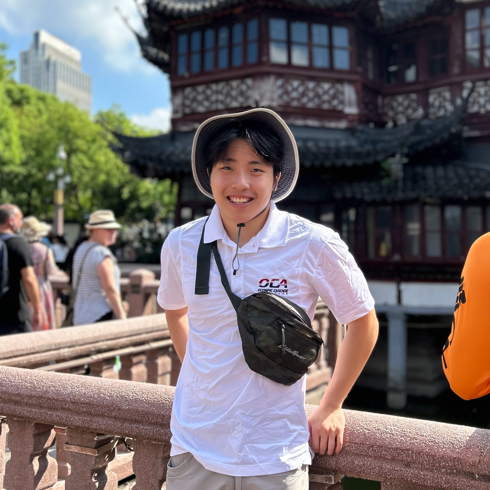

## About Me

Hi! I am a student at the University of Washington double majoring in Computer Science and Math. I also study history on the side. I currently work as a research assistant at the [RAIVN Lab](https://raivn.cs.washington.edu/) under [Prof. Ali Farhadi](https://homes.cs.washington.edu/~ali/) and [Prof. Ranjay Krishna](https://www.ranjaykrishna.com/index.html). I work closely with [Aditya Kusupati](https://adityakusupati.github.io/) and [Matt Wallingford](https://mattwallingford.github.io/).

My current research interests include:
- Understanding the internal behavior of vision and language models.
- Efficient model architectures.
- AI and social/natural sciences.

**I will be joining the [AI2](https://allenai.org/) as a research intern starting March 2025, and Tesla FSD as a research intern starting September 2025.**

## Publications

1. **Perception Tokens Enhance Visual Reasoning in Multimodal Language Models**\
Mahtab Bigverdi, Zelun Luo, Cheng‑Yu Hsieh, <u>Ethan Shen</u>, Dongping Chen, Linda Shapiro, Ranjay Krishna\
*Under Review*\
[pdf](https://arxiv.org/abs/2412.03548v1)

2. **Superposed Decoding: Multiple Generations from a Single Autoregressive Inference Pass**\
<u>Ethan Shen</u>, Alan Fan, Sarah M Pratt, Jae Sung Park, Matthew Wallingford, Sham M. Kakade, Ari Holtzman, Ranjay Krishna, Ali Farhadi, Aditya Kusupati\
*NeurIPS 2024*\
[pdf](https://arxiv.org/abs/2405.18400) [code](https://github.com/RAIVNLab/SuperposedDecoding)

3. **Are "Hierarchical" Visual Representations Hierarchical?**\
<u>Ethan Shen</u>, Ali Farhadi, Aditya Kusupati\
*NeurIPS 2023 Workshop on Symmetry and Geometry in Neural Representations*\
[pdf](https://arxiv.org/pdf/2311.05784.pdf) [code](https://github.com/ethanlshen/HierNet)

## Projects
1. **Video-Language Models as Out-of-the-Box Reward Functions**\
*CSE 542 Reinforcement Learning Final Project*\
[code](https://github.com/ethanlshen/vlmrm-video)

2. **Generative Visual Question Answering**\
*CSE 493 Deep Learning Final Project*\
[pdf](https://arxiv.org/pdf/2307.10405.pdf)

## Essays

1. **Gregory of Tours and Einhard: Clovis and Charlemagne**\
In this essay, I analyze the credibility of Einhard and Gregory of Tours as sources on Clovis and Charlemagne, two of the most influential figures in the Early Middle Ages.\
[essay](assets/Einhard.pdf)

2. **The Detroit Riots of 1967**\
I contend that the Detroit Riots of 1967 were primarily caused by the decentralization of Detroit's automobile industry in the decade prior.\
[essay](assets/HI.pdf)