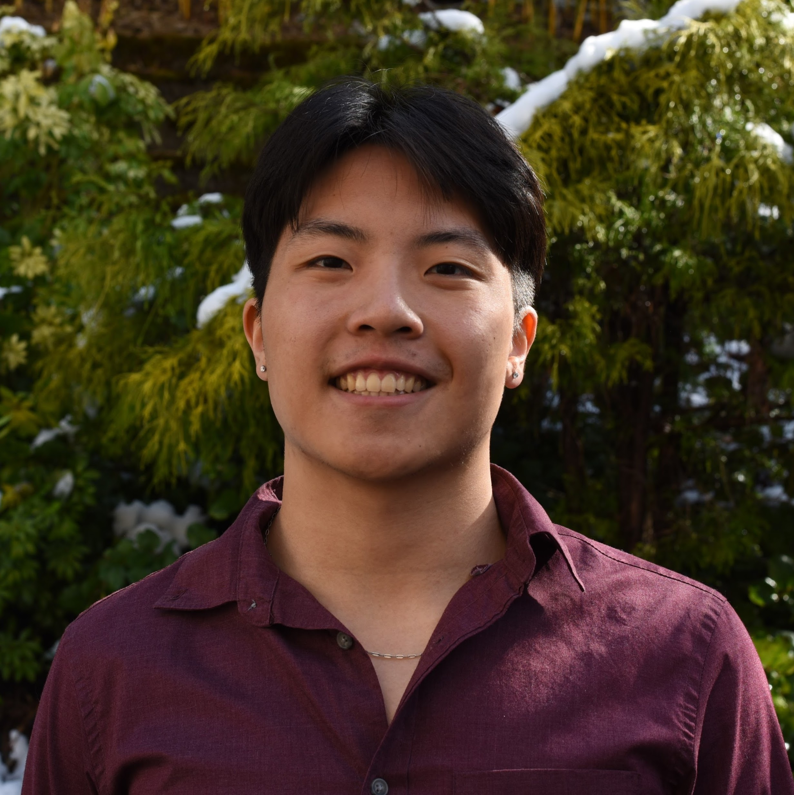

## About Me

Hi! I am a first-year PhD student at the University of Washington advised by [Prof. Ali Farhadi](https://homes.cs.washington.edu/~ali/). I also closely collaborate with [Prof. Tim Dettmers](https://timdettmers.com/). I currently work on coding agents at the [Allen Institute of AI](https://allenai.org/). My research is supported by the PD Soros and NSF GRFP Fellowships.

My current research interests include:
- Agents for code and science
- New model architectures
- Data curation

In my free time, I like to study history, take pictures, and swim/lift.

## Publications

1. **SERA: Soft-Verified Efficient Repository Agents**\
<u>Ethan Shen</u>, Daniel Tormoen, Saurabh Shah, Ali Farhadi, Tim Dettmers\
*Preprint 2026*\
[pdf](https://arxiv.org/pdf/2601.20789) [code](https://github.com/allenai/SERA) [news](https://www.geekwire.com/2026/ai2-cooks-up-open-source-coding-agents-with-tech-equivalent-of-a-hot-plate-and-a-frying-pan/)

2. **Perception Tokens Enhance Visual Reasoning in Multimodal Language Models**\
Mahtab Bigverdi, Zelun Luo, Cheng‑Yu Hsieh, <u>Ethan Shen</u>, Dongping Chen, Linda Shapiro, Ranjay Krishna\
*CVPR 2025*\
[pdf](https://arxiv.org/abs/2412.03548v1) [code](https://github.com/mahtabbigverdi/Aurora-perception)

3. **Superposed Decoding: Multiple Generations from a Single Autoregressive Inference Pass**\
<u>Ethan Shen</u>, Alan Fan, Sarah M Pratt, Jae Sung Park, Matthew Wallingford, Sham M. Kakade, Ari Holtzman, Ranjay Krishna, Ali Farhadi, Aditya Kusupati\
*NeurIPS 2024*\
[pdf](https://arxiv.org/abs/2405.18400) [code](https://github.com/RAIVNLab/SuperposedDecoding)

4. **Are "Hierarchical" Visual Representations Hierarchical?**\
<u>Ethan Shen</u>, Ali Farhadi, Aditya Kusupati\
*NeurIPS 2023 Workshop on Symmetry and Geometry in Neural Representations*\
[pdf](https://arxiv.org/pdf/2311.05784.pdf) [code](https://github.com/ethanlshen/HierNet)

## Projects
1. **Video-Language Models as Out-of-the-Box Reward Functions**\
*CSE 542 Reinforcement Learning Final Project*\
[code](https://github.com/ethanlshen/vlmrm-video)

2. **Generative Visual Question Answering**\
*CSE 493 Deep Learning Final Project*\
[pdf](https://arxiv.org/pdf/2307.10405.pdf)

## History Essays

1. **Gregory of Tours and Einhard: Clovis and Charlemagne**\
In this essay, I analyze the credibility of Einhard and Gregory of Tours as sources on Clovis and Charlemagne, two of the most influential figures in the Early Middle Ages.\
[essay](assets/Einhard.pdf)

2. **The Detroit Riots of 1967**\
I contend that the Detroit Riots of 1967 were primarily caused by the decentralization of Detroit's automobile industry in the decade prior.\
[essay](assets/HI.pdf)